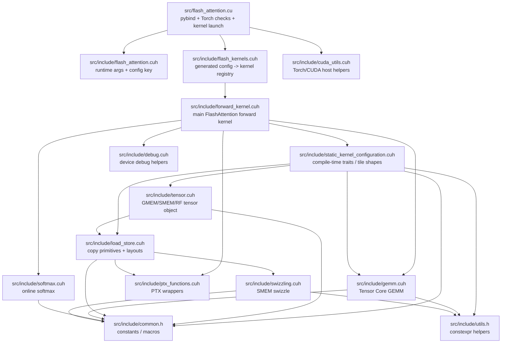

# `src` Codebase Map

这份文档只讲 `src/`。目标不是展开所有模板细节，而是先帮你建立一个稳定的心智模型：文件怎么分层、谁调谁、每个文件主要用了哪些 CUDA / Torch / pybind 特性。

## 1. `src` 是怎么组织起来的

`src` 可以先按 4 层看：

1. 入口绑定层：把 Python/Torch tensor 变成一次 CUDA kernel launch。
2. 配置与注册层：把 runtime 配置映射到某个编译期 kernel specialization。
3. 数据表示与搬运层：把同一块矩阵在 GMEM / SMEM / RF 三层中的表示和 copy 原语封装起来。
4. 计算层：QK GEMM、online softmax、PV GEMM。

最短主链路可以记成：

`flash_attention.cu -> flash_kernels.cuh -> forward_kernel.cuh -> static_kernel_configuration.cuh -> tensor/load_store/gemm/softmax/ptx_functions`

一句话版：

- `flash_attention.cu` 负责“接 Python、验参数、launch”
- `flash_kernels.cuh` 负责“查表选 kernel”
- `static_kernel_configuration.cuh` 负责“把配置变成编译期 traits”
- `forward_kernel.cuh` 负责“按 FlashAttention 流程执行”
- `tensor/load_store/ptx/swizzling` 负责“数据怎么搬”
- `gemm/softmax` 负责“数学怎么做”

## 2. 每个文件做什么，用了什么特性

### 入口绑定层

`src/flash_attention.cu`

- 职责：`src` 唯一 `.cu` 入口；把 Python `kernel_cfg` 转成 `FlashForwardKernelConfig`，检查 `torch::Tensor`，从 `forward_kernels` 查到函数指针，然后发射 kernel。
- Torch / pybind 特性：`PYBIND11_MODULE`、`py::object`、`py::cast`、`torch::Tensor`、`TORCH_CHECK`、`at::cuda::CUDAGuard`、`at::cuda::getCurrentCUDAStream()`。
- CUDA 特性：原生 kernel launch `<<<grid, block, smem, stream>>>`、动态 shared memory 大小、`cudaFuncSetAttribute` 设置大 shared memory、`cudaEvent` benchmark。

`src/include/cuda_utils.cuh`

- 职责：host 侧辅助；封装 `CHECK_INPUT`、`CEIL_DIV`、设备属性查询。
- Torch / CUDA 特性：`TORCH_CHECK`、`cudaDeviceGetAttribute`、`cudaGetDeviceProperties`。

### 配置与注册层

`src/include/flash_attention.cuh`

- 职责：定义 runtime 参数包 `ForwardKernelArgs` 和查表 key `FlashForwardKernelConfig`，是整个 `src` 的“协议层”。
- C++ / Torch 特性：`torch::ScalarType`、`operator<` 作为 `std::map` key、shared memory 占用估算函数。

`src/include/flash_kernels.cuh`

- 职责：生成文件；保存 `std::map<FlashForwardKernelConfig, forward_kernel_fn>`，把 runtime 配置映射到具体模板 kernel。
- C++ / CUDA 特性：函数指针表、模板实例地址 `&flash_forward_kernel<...>`。
- 注意：这是 generated file，不应该手改。

`src/include/static_kernel_configuration.cuh`

- 职责：把 runtime 风格的 `FlashForwardKernelConfig` 提升成编译期 traits，推出 tile shape、类型别名、LD/ST 配置和两次 GEMM 的类型。
- CUDA / C++ 特性：non-type template parameter、`static_assert` 做配置合法性检查、`constexpr` 推导 tile 大小、dtype 到 `half` / `nv_bfloat16` 的编译期分派。

### Kernel 主体层

`src/include/forward_kernel.cuh`

- 职责：真正的 FlashAttention forward kernel。一个 CTA 处理一个 `(sample, head, q_block)`，扫描全部 KV blocks，依次做 Q/K/V load、`QK^T`、online softmax、`P@V`、最后写回 `O`。
- CUDA 特性：`__global__`、`__grid_constant__`、`extern __shared__`、`blockIdx`/`threadIdx`、`__syncthreads()`、`__syncwarp()`、`cp.async` pipeline、寄存器常驻的 `S/P/O_accum`。
- 硬件特性：SM80+ 假设明显，围绕 Tensor Core 路径组织数据流。

### 数据表示与搬运层

`src/include/tensor.cuh`

- 职责：定义 `RFVector`、`RFMatrix`、`MatrixLDST`；把一个矩阵块在 GMEM / SMEM / RF 三层的视角统一起来。
- CUDA / C++ 特性：模板化对象封装、寄存器数组、warp 局部视角、同一个对象上暴露 `copy_GM2SM` / `copy_SM2RF` / `copy_RF2SM` / `copy_SM2GM`。

`src/include/load_store.cuh`

- 职责：定义 `TensorLDSTConfig` 和底层 copy 原语；决定一个 warp 如何搬 tile。
- CUDA 特性：`cp.async`、`ldmatrix`、16B `uint4` 向量化 load/store、shared memory layout、转置加载 V。
- 硬件特性：bank-conflict 规避、warp 协作式 tile 搬运、fp32 到 fp16/bf16 的向量化转换。

`src/include/swizzling.cuh`

- 职责：shared memory swizzle 地址映射；主要服务 `load_store.cuh`。
- CUDA / 硬件特性：`constexpr` 地址变换，核心目标是减少 SMEM bank conflict。

`src/include/ptx_functions.cuh`

- 职责：封装底层 PTX 原语。
- CUDA / 硬件特性：inline PTX `cp.async.commit_group`、`cp.async.wait_group`、`cp.async.cg.shared.global`、`ldmatrix.sync.aligned.x4`、`mma.sync.aligned.m16n8k16`。
- 理解方式：这是最接近硬件的一层适配。

### 计算层

`src/include/gemm.cuh`

- 职责：定义 Tensor Core GEMM 模板和 `matmul` 调度，服务 `QK` 与 `PV` 两次乘法。
- CUDA / 硬件特性：warp 级 MMA、`mma.sync` 累加到 fp32、可选 double-buffered SMEM->RF load。
- 理解方式：它只关心 A/B/C 的布局和 K 方向迭代，不关心 Q/K/V 的语义。

`src/include/softmax.cuh`

- 职责：online softmax 的寄存器计算，包括 row max、exp sum、`O_accum` 缩放和最终归一化。
- CUDA 特性：warp shuffle `__shfl_xor_sync` 做行内归约。
- 数学特性：支持普通 `expf` 路径，也支持 `exp2f + M_LOG2E` 的 optimized softmax 路径。

### 基础设施层

`src/include/common.h`

- 职责：全局常量和宏，定义 fragment 尺寸、warp 大小、向量化访存粒度等。
- CUDA 特性：`FA_DEVICE` / `FA_DEVICE_CONSTEXPR`、warp / MMA / ldmatrix 相关常量。

`src/include/utils.h`

- 职责：很薄的 `constexpr` helper。
- C++ 特性：编译期 `min`、编译期 `log2 floor`。

`src/include/debug.cuh`

- 职责：设备端调试输出，打印 SMEM / RF 数据，帮助对齐 warp 视角观察 kernel 内部状态。
- CUDA 特性：device `printf`、按 block / warp 条件打印、`__syncwarp()` 保持打印顺序。
- 注意：不在主执行链上。

## 3. 推荐阅读顺序

如果只是想先建立全局图景，按下面顺序读最省力：

1. `src/flash_attention.cu`
2. `src/include/flash_attention.cuh`
3. `src/include/flash_kernels.cuh`
4. `src/include/static_kernel_configuration.cuh`
5. `src/include/forward_kernel.cuh`
6. `src/include/tensor.cuh`
7. `src/include/load_store.cuh`
8. `src/include/gemm.cuh`
9. `src/include/softmax.cuh`
10. `src/include/ptx_functions.cuh`

读法建议只有一句：

先看“怎么被 launch”，再看“怎么选 specialization”，最后看“数据怎么搬、数学怎么算”。
